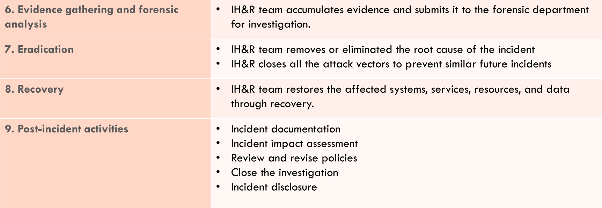
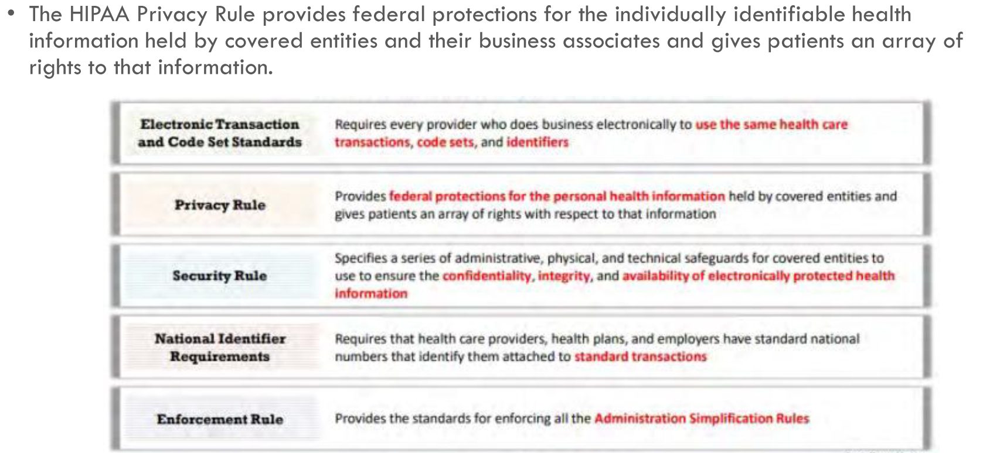

# CEH

_________________________________________________

## Defense in depth

View course

## Risk

- threat
    - weakness
    - capability
    - bad intent
- vulnerability
- impact
    - damage: level of severity
    - magnitude: amount of damage

## Risk levels

Qualitative can be or Quantitative

- Actions
    - Extreme / high
        - install EDR
        - Training employees
    - Medium
        - SLAs
    - Low
        - preventive actions

## Risk management

process of reducing and maintaining risks at a reasonable levem

- Phases
    - Risk review : Identify whether the treatment was efficient.

## Indicators of compromise (Artifact)

Evidence that an event related to a compromise has happened

- IP adresses
- Mutex values
- DNS requests ... .

## Threat intelligence

Intelligence about threats

### Intelligence

intelligence = Information + indicators + context

Evidence based knowledge including context, mechanisms, indicators, implications and actionable advice, about an
existing or emerging menace or hazard to assets that can be used to inform decisions regarding the subject’s response to
that menace or hazard.

### Cyber threat intelligence (CTI)

collection and analysis of information about threats and adversaries and the drawing up of patterns that provide an
ability to make knowledgeable decisions for preparedness, prevention, and response actions against various cyberattacks.

### Types of CIT

- Low level / Short terms / Technical : Technical people, Securityt operation center (SOC)
    - contains IoCs
    - technical reports (JSON)
- higher level / Short terms / Operational / technical : SOC / incident response teams / SOC managers
    - IoCs and More focused indicators and human readable
- Low level / long term / Tactical :
    - TTPs : tactics techniques and procedures
    - building scenarios
    - Cyber kill chain
    - human readable reports
- Highest level / long term / startegic : For executive / CISO / IT managers
    - Include trends
    - Not very technical recommendations

## Threat modeling

Understanding the threat landscape and improve the security design\
Exercises done by devs and network architecture responsibles

- Threat modeling process
  

## Incident management

- A set of processes to identify, analyse, prioritize, resolve security to restore the system to normal service
  operations as soon as possible, and prevent recurrence of the incident.
- Incident response : has to be ***A true positive***
- Security professionals should identify software that is open to attacks before someone takes advantage of the
  vulnerabilities.
- Incident response should fix the problem
    - Negotiators.
    - People from legal / regulatory domain.
    - Police.
    - Malware analysts.
    - Technical team
        - Working on the blast radius
        - Entry point
- Incident management:
    - Improve service quality.
    - Resolve problems proactively.
    - Reduce the impact of incidents on an organization or its business.
    - Meet service availability requirements.
    - Increase staff efficiency and productivity.
    - Improve user and customer satisfaction.
    - Assist in handling future incidents

- Incident handling:
    - SOC composed of layers:
        - Layer 1: Junior SOC analysts (Can be automated / externalized)
            - Triage
            - Have a scope of basic incidents
        - Layer 2: Malware analysts / Vulnerability management analysts
        - Layer 3: People who lead threat intelligence...
        - Layer 4: Managers.

## ISO 27001

... .

## HIPPA

_____________________________________________________

## Side Notes:

- TLP : protocol
    - Red : Read / Delete.
    - Amber : Read / Share with colleagues.
    - Green : Read / Share anywhere byt nothing public.
    - White : whatever you want.
- TTR - TTD - TTS : Time to Respond - Time to Detect - Time to Solve.
- XDR: Based on AI.
- PCDI DSS: Payment Card Data Industry Data Security Standard
- SIM SWAP.